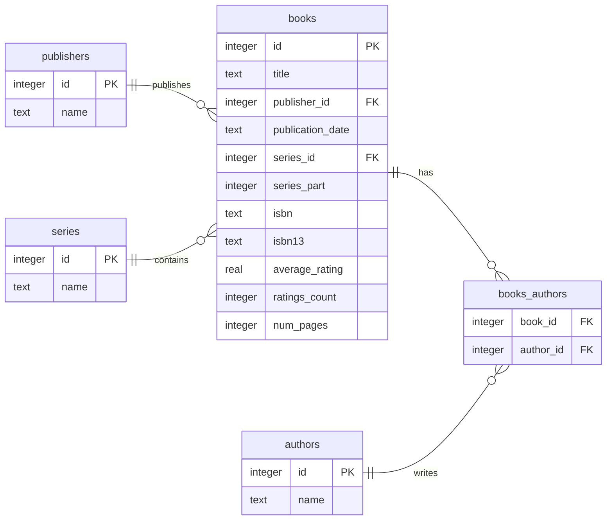

# bookstats

A relational database built from an 11k-row Goodreads book dataset, produced by a filter → clean → normalise → seed pipeline. First portfolio project for a data analyst career switch.

**Status:** ETL/ELT and schema design are done, DB is seeded and FK-enforced. Analysis and visualisation against [`questions.md`](questions.md) is next (see [What's next](#whats-next)).

## Dataset

[Goodreads Books dataset (Kaggle)](https://www.kaggle.com/datasets/jealousleopard/goodreadsbooks), scoped to English-language rows only. The dataset is at **edition** grain, not **work** grain: each row is a specific ISBN, so the same novel can have multiple rows, one per hardback, paperback, or reprint edition.

This distinction is the basis for most modelling decisions below (however may be adjusted to 'works' with some scraping work in the future).

## Pipeline

```
data/raw/books.csv
  │  filter.py: drops non-English, box sets, "NOT A BOOK" rows
  ▼
data/interim/books_filtered.csv
  │  clean.py: whitespace, nulls, publisher dedup, ISO dates
  ▼
data/clean/books_clean.csv
  │  normalise.py: extracts series, explodes authors
  ▼
data/clean/books_modelled.csv
  │  seed.py: staging load, then schema.sql + transform.sql build the entity tables
  ▼
db/books.db
```

Each stage is its own script (`scripts/filter.py`, `clean.py`, `normalise.py`, `seed.py`), run in order by `scripts/run_all.py`. Filtering determines which rows are retained; cleaning fixes values within those rows (whitespace, nulls, publisher dedup, dates); normalising reshapes structure (splitting series/authors out of the title). By the time `seed.py` runs, that value-level work is already done: it loads the flat, cleaned file into a staging table as-is, and hand-written SQL (`db/transform.sql`) does the remaining structural step of splitting it into normalized entity tables. That last step is ELT rather than ETL: the relational modelling happens in SQL, not in pandas, so it stays in inspectable `.sql` files rather than embedded in DataFrame code.

| Stage    | Rows            | Notes                                                       |
| -------- | --------------- | ----------------------------------------------------------- |
| Raw      | 11,127 → 11,123 | 4 malformed CSV lines skipped (verified non-English)        |
| Filtered | 10,446          | −586 non-English, −5 `NOT A BOOK` marker rows, −86 box sets |
| Modelled | 18,146          | exploded 1 row per (book, author)                           |

## Data model



10,446 books, 8,897 authors, 1,972 publishers, 1,041 series. `books_authors` is the only many-to-many junction: book→series and book→publisher are one-to-many, so those foreign keys are columns directly on `books`.

## Key decisions

- **Edition grain, not work grain.** Rows are per-ISBN editions, so `ISBN` is the only reliable per-row key: a natural key like (series, part, publisher) breaks because one publisher can issue a hardback, a paperback, and a reprint of the same book.
- **`series.name` is `UNIQUE` on name alone.** ~27% of series have multiple listed authors, ruling out a compound (name + author) key; the same-name conflict risk this creates is accepted and documented rather than solved.
- **`series` has no author column.** Authorship is a book-level attribute, not a series-level one (derivable by joining `series` → `books` → `books_authors`), so a drafted `series.author_id` was dropped as redundant and mislocated.
- **Disguised nulls, handled per column.** `average_rating` 0 → NaN (an average of nothing is undefined), `num_pages` 0 → NaN (a book cannot have 0 pages), `ratings_count` 0 → NaN only for the 39 rows where a nonzero average contradicts a 0 count (a genuine zero count is kept everywhere else).
- **Publisher dedup: count-based pick + manual override.** Count-based normalisation (2,045 → 1,972 distinct names, ~430 rows corrected) picks whichever spelling is most frequent in the raw data. For a handful of publishers, though, the more frequent spelling is itself the error (e.g. "Simon Schuster" outnumbering "Simon & Schuster" because ampersands were stripped inconsistently before this data was collected). A small override table corrects those specific cases by hand, each checked against the publisher's own website.
- **ELT for the schema load, not ETL.** Filtering, cleaning, and normalising happen in pandas beforehand; `seed.py` then loads that already-cleaned flat file into a staging table as-is, and hand-written SQL (`db/transform.sql`) splits it into normalized entity tables: the relational modelling happens in SQL, after loading, not in pandas beforehand.
- **One invalid date, not guessed.** A single row has `11/31/2000` (not a valid calendar date, since November has 30 days). Rather than pick the nearest valid date, it was set to NULL and documented.

## Known limitations

- **No work-level dedup.** Editions of the same title aren't merged, so rating aggregates are per-edition, not per-book.
- **Author identity = name string.** No entity resolution: two authors with the same name would incorrectly merge into one row.
- **Roles aren't modelled.** Everyone listed under a book's authors field is stored as an author, including translators, since the source data doesn't distinguish roles.
- **A few nulls, and why:** 70 books have no page count, 1 has no publication date (`11/31/2000` in the source, an invalid date set to NULL rather than guessed).

## Running it

```bash
git clone https://github.com/gre-ni/bookstats.git
cd bookstats
pip install -r requirements.txt
pip install -e .
python -m scripts.run_all
```

Produces `db/books.db`. Tests: `pytest`.

## Repo structure

```
bookstats/       clean, publishers, formatting: shared logic, imported by scripts and tests
scripts/         filter → clean → normalise → seed, plus run_all.py
db/              schema.sql (DDL), transform.sql (staging → entities)
notebooks/       exploration and working notebooks behind each script
tests/           parametrized tests for cleaning + publisher dedup
data/            raw / interim / clean, gitignored
```

## What's next

- **Analytical portion:** Answer questions in [`questions.md`](questions.md) (publisher/rating relationships, genre and page-count distributions, rating vs. popularity) and visualise the results.
- Expanding the database with a scraping pipeline or other available APIs:
    - TOP priority: 'authors' classification into writers, translators and illustrators
    - Genre information
    - Demographic information about authors
    - Awards and prizes (Booker, Nobel)
    - Trigger warnings
    - Adding more recently released titles
- Work-level deduplication across editions (fuzzy title matching)
